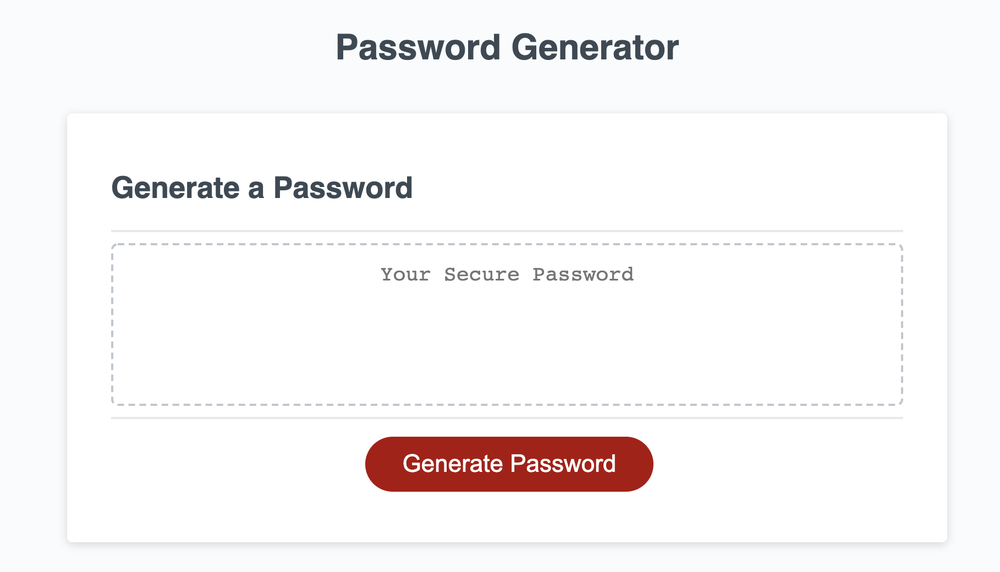
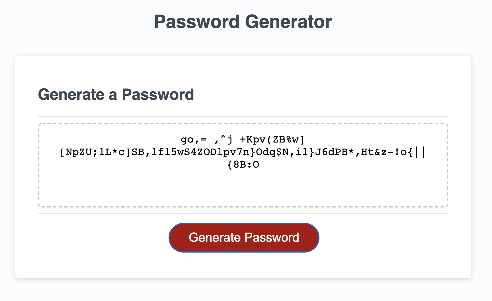

# Password Generator

The goal of this project is to provide a randomized password based on the criteria inputted from the user.

## Usage

The user will input:

    - # of Characters (betweeen 8-128)
    - Whether or not to use Uppercase characters
    - Whether or not to use Lowercase characters
    - Whether or not to use Numeric characters
    - Whether or not to use Special characters

and the computer will generate a random password containing characters specified by the user.

## Features

After the user provides what array of characters will be included in the password, the user can click the "Generate Password" button to receive an output of a randomized password including the desired array of characters.

## Screenshots

## Link to Repo

https://github.com/mfandel118/password-generator-homework3
